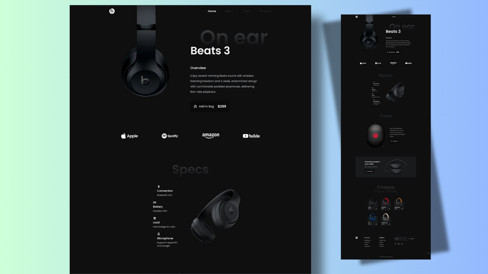

# Responsive Landing Page — Headphones

A modern, responsive landing page template for a headphone product. Clean layout, mobile-first design, and simple animations — ideal as a starting point for product pages, portfolios, or small storefronts.



Highlights
- Fully responsive layout (mobile → desktop)
- Built with semantic HTML, SCSS, and vanilla JavaScript
- Modular SCSS structure for easy customization
- Lightweight and easy to deploy

Quick demo

- Open the `index.html` file in your browser.
- Or serve locally (recommended) and open http://localhost:8000

PowerShell (requires Python):

```powershell
python -m http.server 8000
# then open http://localhost:8000 in your browser
```

Or use the VS Code Live Server extension to preview instantly.

Project structure

- `index.html` — Main page
- `assets/css/styles.css` — Compiled stylesheet
- `assets/scss/` — Source SCSS (partials grouped by purpose)
- `assets/js/main.js` — Small interactive bits
- `assets/img/` — Images used by the page (including `preview.png`)

Built with

- HTML5
- SCSS (Sass)
- Vanilla JavaScript

How to customize

1. Edit SCSS source files in `assets/scss/` and recompile to `assets/css/styles.css` (e.g., using the Sass CLI).
2. Replace images in `assets/img/`.
3. Tweak markup in `index.html` and scripts in `assets/js/main.js`.

Accessibility & performance notes

- Uses semantic tags (header, main, footer) for better accessibility.
- Images are already optimized but can be further compressed for faster load.

Contributing

Contributions are welcome — open an issue or submit a pull request. Keep changes focused and provide a short description of why the change is needed.

License

This project is licensed under the terms in the `LICENSE` file.

Author

Made by mdasifislamm


